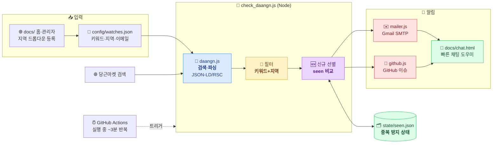
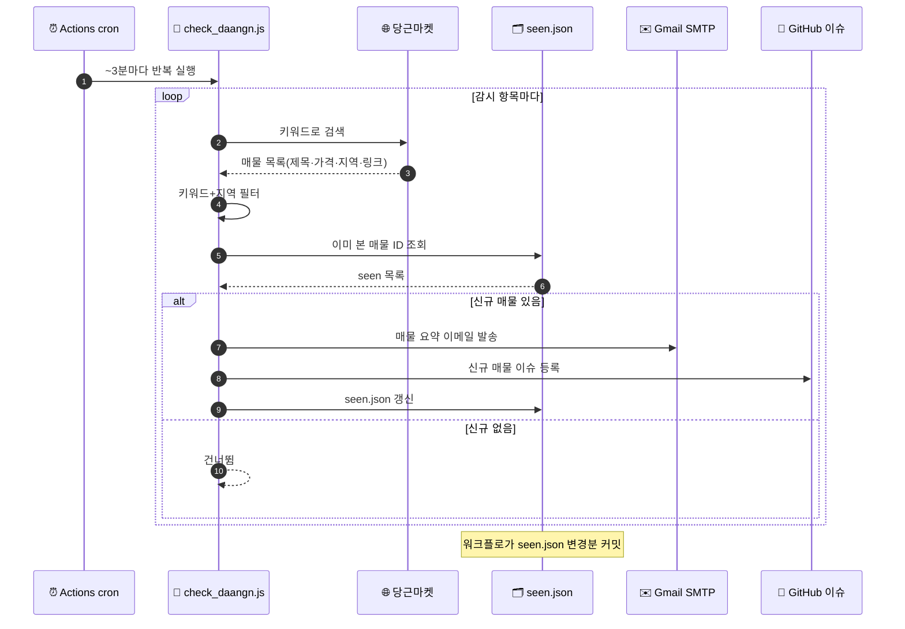
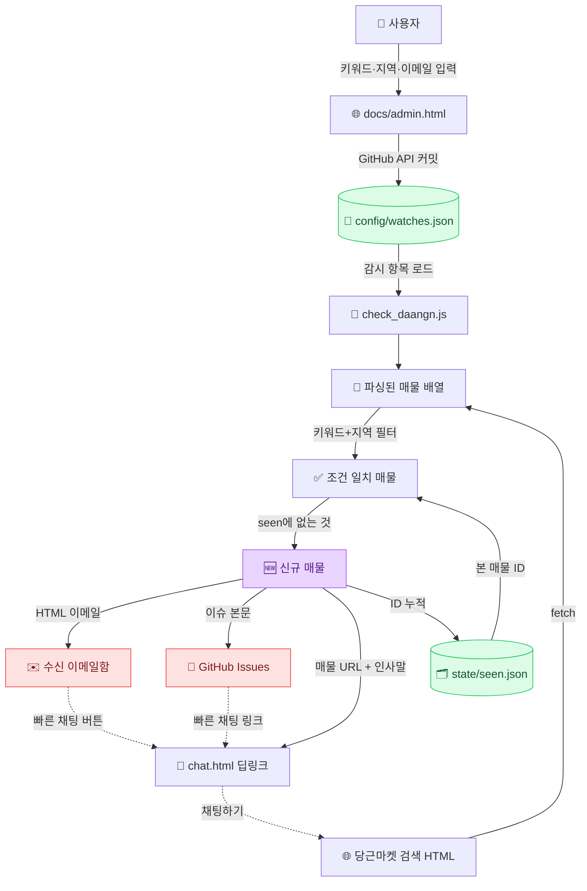

# 🛒 중고 알리미 (used-notifier)

원하는 **제품 키워드**·**구매 지역**·**희망 금액**을 등록하면, [당근마켓](https://www.daangn.com/kr/)과
[중고나라](https://web.joongna.com)에 조건에 맞는 **신규 매물**이 올라올 때 **Gmail 이메일**과
**GitHub 이슈**로 알림을 보내주는 웹앱입니다.

> 예시) 제품 `가마솥`, 지역 `수원시`, 희망가 `100,000원` 을 등록 → 판매 위치가 수원이면서 제목에
> "가마솥"이 포함되고 가격이 10만원 이하인 새 매물이 당근마켓/중고나라에 올라오면, 지정한 이메일로
> 매물 정보와 구매 링크가 도착합니다. 감시 항목마다 검색할 사이트를 선택할 수 있습니다.

---

## 🧩 한눈에 보기

감시 목록(`config/watches.json`)을 기준으로 당근마켓·중고나라를 **검색**하고, 신규 매물만 **선별**해
**이메일·GitHub 이슈** 두 갈래로 **알림**을 보내는 단일 파이프라인입니다. GitHub Actions가
실행되면 **한 job 안에서 약 3분마다 반복 점검**하여 신규 매물을 빠르게 잡아냅니다.



| 단계 | 모듈 | 한 줄 설명 |
|---|---|---|
| 📡 **검색·파싱** | [`scripts/daangn.js`](scripts/daangn.js) | 당근 검색 HTML에서 매물 파싱 (JSON-LD → RSC 스트림 → 링크 폴백) |
| 🔎 **필터** | [`scripts/daangn.js`](scripts/daangn.js) | 제목에 키워드 포함 + 지역 일치(어간/구 분해 매칭, 미입력 시 전국) |
| 🆕 **신규 선별** | [`scripts/check_daangn.js`](scripts/check_daangn.js) | `state/seen.json`과 비교해 새 매물만 추출 |
| ✉️ **이메일** | [`scripts/mailer.js`](scripts/mailer.js) | Gmail SMTP로 매물·구매 링크·빠른 채팅 버튼 발송 |
| 🐙 **이슈** | [`scripts/github.js`](scripts/github.js) | 신규 매물을 `당근마켓-알림` 라벨 이슈로 등록 |
| 🌐 **등록 UI** | [`docs/`](docs) | 홈/관리자(지역 드롭다운)·빠른 채팅 도우미 (GitHub Pages) |
| ⏰ **자동화** | [`daangn-alert.yml`](.github/workflows/daangn-alert.yml) | 실행되면 job 내부에서 ~3분마다 반복 점검·알림·상태 커밋 |

---

## 동작 흐름 (Operation Flow)

GitHub Actions 가 실행되면 아래 순서를 ~3분마다 반복합니다. 각 감시 항목/알림 채널은 독립적으로
실패를 흡수하므로 한 항목이 실패해도 나머지는 계속 진행됩니다.



1. **검색** — `check_daangn.js`가 각 감시 항목의 키워드로 당근마켓을 검색·파싱합니다.
2. **필터** — 제목에 키워드가 있고 지역이 일치하는(미입력 시 전국) 매물만 남깁니다.
3. **선별** — `state/seen.json`과 비교해 아직 알리지 않은 신규 매물만 고릅니다.
4. **알림** — 이메일과 GitHub 이슈로 각각 발송(하나라도 성공하면 상태 갱신).
5. **기록** — `seen.json`을 갱신·커밋해 다음 실행 때 중복 알림을 막습니다.

---

## 데이터 플로 (Data Flow)

데이터는 **감시 설정 → 검색 결과 → 신규 매물 → 알림/상태**로 흐릅니다. `watches.json`과
`seen.json` 두 파일이 진실의 원천이며, 홈페이지·관리자는 `watches.json`을, 워크플로는
`seen.json`을 읽고 씁니다.



| 데이터 | 위치 | 역할 |
|---|---|---|
| 감시 설정 | `config/watches.json` | 키워드·지역·이메일·인사말 (홈/관리자가 기록) |
| 검색 결과 | (메모리) | 당근 검색 HTML을 파싱한 매물 배열 |
| 신규 매물 | (메모리) | 필터 통과 & `seen`에 없는 매물 |
| 중복 방지 상태 | `state/seen.json` | 감시 항목별 이미 알린 매물 ID (워크플로가 커밋) |
| 알림 결과 | 이메일 / GitHub 이슈 | 매물 정보 + 구매 링크 + 빠른 채팅 도우미 |

---

## 구성

| 경로 | 설명 |
| --- | --- |
| `docs/` | 홈페이지(GitHub Pages). 키워드·지역·이메일을 입력해 감시 설정을 생성 |
| `docs/admin.html` | 웹 관리자. GitHub API로 감시 목록을 조회·추가·수정·삭제하고 커밋 |
| `docs/chat.html` | 빠른 채팅 도우미. 이메일에서 열려 인사말 복사 + 매물 채팅 화면으로 이동 |
| `config/watches.json` | 감시 목록(키워드/지역/이메일) |
| `scripts/` | 당근마켓 검색·파싱·이메일 발송 Node 스크립트 |
| `state/seen.json` | 이미 알림 보낸 매물 ID (중복 방지, 워크플로가 자동 커밋) |
| `.github/workflows/daangn-alert.yml` | GitHub Actions (job 내부에서 ~3분마다 반복 점검) |

> 전체 동작은 위의 [한눈에 보기](#-한눈에-보기) · [동작 흐름](#동작-흐름-operation-flow) ·
> [데이터 플로](#데이터-플로-data-flow) 다이어그램을 참고하세요.

---

## 설정 방법

### 1. Gmail 앱 비밀번호 발급
1. 발신용 Gmail 계정에서 **2단계 인증**을 켭니다.
2. [앱 비밀번호](https://support.google.com/accounts/answer/185833)에서 16자리 비밀번호를 발급합니다.

### 2. GitHub Secrets / Variables 등록
저장소 **Settings → Secrets and variables → Actions** 에서 등록합니다.

**Secrets** 탭 (`New repository secret`) — 민감정보:

| 이름 | 값 |
| --- | --- |
| `GMAIL_APP_PASSWORD` | 위에서 발급한 앱 비밀번호(16자리) |

**Variables** 탭 (`New repository variable`) — 비민감정보:

| 이름 | 값 |
| --- | --- |
| `GMAIL_USER` | 발신 Gmail 주소 (예: `myname@gmail.com`) |
| `MAIL_FROM_NAME` | (선택) 발신자 표시 이름 |

> ℹ️ `GMAIL_USER` 는 이메일 주소일 뿐 민감정보가 아니므로 **Variables** 에 두는 것을 권장합니다.
> 워크플로는 `vars.GMAIL_USER` 를 먼저 읽고 없으면 `secrets.GMAIL_USER` 로 폴백하므로,
> 둘 중 **어느 쪽에 등록해도** 동작합니다. `GMAIL_APP_PASSWORD` 는 반드시 **Secrets** 에 두세요.

### 3. 감시 항목 등록

**방법 A — 웹 관리자 (권장):** [관리자 페이지](https://leemgs.github.io/carrot-market/admin.html)에서
감시 항목을 **조회·추가·수정·삭제**하고 GitHub에 바로 저장합니다.
파일을 직접 편집할 필요가 없습니다.

- GitHub **Fine-grained 토큰**(이 저장소, Contents Read and write)이 필요합니다.
  [토큰 만들기](https://github.com/settings/personal-access-tokens/new)
- 토큰은 브라우저 `localStorage` 에만 저장되며 서버로 전송되지 않습니다.
  공용 PC에서는 사용 후 "토큰 삭제"를 누르세요.

**방법 B — 수동 편집:** [홈페이지](https://leemgs.github.io/carrot-market/)에서 설정 코드를 생성하거나
`config/watches.json` 을 직접 편집합니다.

```json
{
  "defaultEmail": "myname@gmail.com",
  "watches": [
    {
      "id": "gamasot-suwon",
      "keyword": "가마솥",
      "location": "수원시",
      "email": "myname@gmail.com",
      "enabled": true
    }
  ]
}
```

| 필드 | 설명 |
| --- | --- |
| `keyword` | 조회할 제품 키워드 (매물 제목에 포함되면 매칭) |
| `sites` | 검색할 사이트 배열 `["daangn","joongna"]`. **미지정이면 전체(당근+중고나라)** |
| `location` | 구매 가능 지역 (매물 지역/제목에 포함되면 매칭). **비우면 전국** |
| `maxPrice` | 희망 금액(원). 이 금액 **이하**인 매물만 알림. 0/미지정이면 제한 없음. 가격 미표기 매물은 포함 |
| `email` | 알림 수신 이메일 (없으면 `defaultEmail` 사용). **여러 명**은 배열 `["a@x.com","b@y.com"]` 또는 쉼표구분 문자열 `"a@x.com, b@y.com"` |
| `chatMessage` | 채팅 도우미에 미리 채울 인사말 (없으면 `defaultChatMessage`) |
| `enabled` | `false` 면 검사 제외 |

최상위 옵션: `sendEmail`(기본 true) · `createIssues`(기본 true) 로
이메일/이슈 알림을 각각 켜고 끌 수 있습니다.

### 알림 채널 (이메일 + GitHub 이슈)
신규 매물이 발견되면 **GitHub 이슈 등록**과 **이메일 발송**을 함께 수행합니다.

- **GitHub 이슈**: 감시 항목별로 신규 매물 목록을 담은 이슈가 `당근마켓-알림` 라벨로
  생성됩니다. Actions 가 자동 제공하는 `GITHUB_TOKEN` 을 사용하므로 별도 설정이 필요 없고,
  워크플로에 `issues: write` 권한이 포함되어 있습니다. 거래 확인 후 이슈를 닫으면 됩니다.
- **이메일**: 위 Gmail SMTP 설정 필요.

### 지역(location) 매칭 규칙
- **비워두면 전국** 대상으로 조회합니다 (`전국`, `전체` 입력도 동일).
- 지역을 넣으면 매물 위치/제목에 그 지역명이 포함될 때 매칭됩니다.
  행정구역 접미사를 뗀 어간도 함께 비교합니다 (`수원시` → `수원`).
- ⚠️ 당근은 매물 위치를 동 이름(예: `영통동`)만 표시하는 경우가 있어, 시 단위 입력이
  일부 매물과 매칭되지 않을 수 있습니다. 이럴 땐 동 이름으로 등록하거나 지역을 비워
  전국으로 받은 뒤 이메일/이슈에서 위치를 확인하세요.
  (`DEBUG=true` 로 실행하면 파싱/매칭 건수를 로그로 확인할 수 있습니다.)

### 빠른 채팅 도우미 (💬)
이메일의 **"💬 빠른 채팅"** 버튼을 누르면 `docs/chat.html` 도우미 페이지가 열립니다.

1. **인사말 복사** 버튼으로 미리 준비된 문구(예: "안녕하세요. 제가 구매 가능할까요?")를 복사
2. **매물에서 채팅하기** 버튼으로 당근마켓 매물 페이지로 이동
3. 매물의 **"채팅하기"** 를 눌러 붙여넣기 후 전송

> ⚠️ 당근마켓은 전화번호+SMS 인증 기반이라 로그인/메시지 전송의 완전 자동화는
> 이용약관 위반과 계정 정지 위험이 있습니다. 그래서 이 도우미는 **인사말 복사와
> 채팅 화면 이동까지만** 자동화하고, 최종 전송은 사용자가 직접 누르도록 설계했습니다.

`CHAT_HELPER_URL` 환경변수로 도우미 페이지 주소를 바꿀 수 있습니다.
(기본값: `https://leemgs.github.io/carrot-market/chat.html`)

### 4. GitHub Pages 활성화 (홈페이지)
저장소 **Settings → Pages → Source** 를 `main` 브랜치 `/docs` 폴더로 지정하면
`https://<사용자>.github.io/carrot-market/` 에서 홈페이지가 열립니다.

---

## 로컬 테스트

```bash
cd scripts
npm install

# 이메일을 보내지 않고 검색 결과만 확인 (DRY_RUN)
DRY_RUN=true node check_daangn.js

# 실제 발송 테스트
GMAIL_USER=me@gmail.com GMAIL_APP_PASSWORD=xxxx node check_daangn.js
```

### 유용한 환경변수
| 변수 | 설명 |
| --- | --- |
| `DRY_RUN=true` | 이메일 발송 없이 신규 매물만 로그 출력 |
| `DAANGN_SEARCH_URL` | 검색 URL 템플릿 재정의 (`{kw}` 가 키워드로 치환) |
| `STRICT_REGION=false` | 매물에 지역 정보가 없을 때도 통과시킴(관대한 매칭) |

---

## 참고 / 한계
- 당근마켓은 공식 오픈 API 를 제공하지 않아, 웹 검색 페이지를 파싱합니다.
  사이트 마크업이 바뀌면 `scripts/daangn.js` 의 `parseItems()` 추출 로직만 수정하면 됩니다.
- 실행 주기(cron)는 `.github/workflows/daangn-alert.yml` 에서 조정할 수 있습니다.
  (GitHub Actions 스케줄은 부하에 따라 몇 분 지연될 수 있습니다.)
- 개인적/비상업적 용도로 사용하고, 당근마켓의 이용약관과 과도한 요청 자제를 준수하세요.
